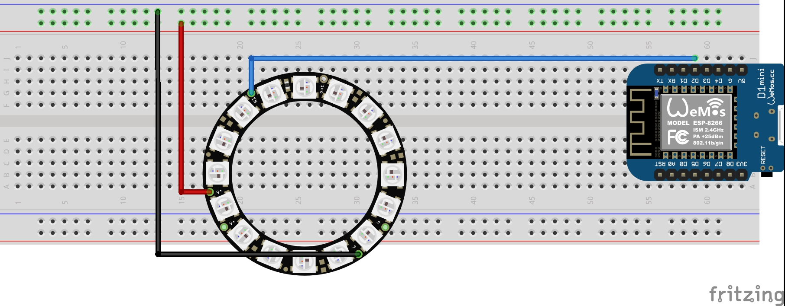

# Augmented Fashion

The sketch uses the Blynk library to control the colors.  

  

---  
The main.cpp is a C++ code. It's useful if you want to work on PlatformIO - that include all librarys -, but you can easily run it on the
Arduino IDE by copying all the code from the main.cpp to the Arduino IDE.  